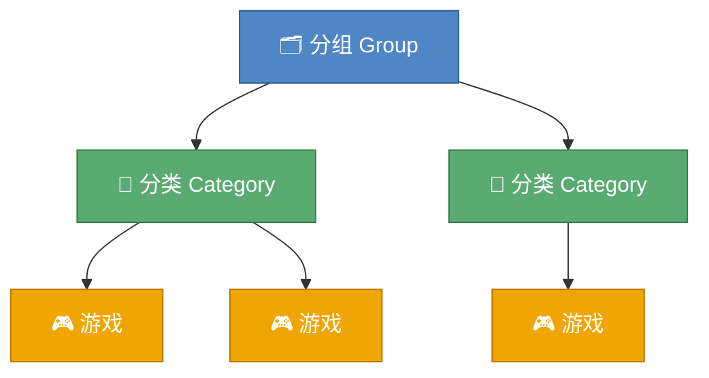

# 收藏夹

收藏夹是 Reina 中用来分类游戏的功能

**注意要先创建分组再创建分类，分类中才能管理游戏，三者关系如下：**

## 开发商分组

- 开发商分组会根据游戏刮削到的开发商信息自动将游戏进行分类

- 虽然你不能直接修改这个分组，但是你可以通过[游戏详情页](editgame.md)修改对应游戏的开发商信息来调整游戏在这个分组中的分类

## 自定义分类

- 如果想添加自己的分类，可点击右上角按钮先创建新的分组，再创建一个或多个分类，分类下可以管理游戏

- 对于自定义的分组和分类，你可以对着它们右键，右键菜单可以进行重命名和管理游戏的操作

- 你还可以通过游戏详情页中的`管理收藏夹`和游戏列表的`批量操作`开关来将游戏添加到某些分类中

